## Smart Video Monitoring (KVS + Rekognition + OpenSearch)
**Work-in-progress**

An automated video monitoring pipeline built on AWS that ingests video from a local camera, performs AI-based object detection, and indexes results for time-based search.

Built from an AWS workshop reference architecture, with independent extensions and documentation.

### Architecture
Kinesis Video Streams (WebRTC) → Lambda (clipper) → Amazon S3 → Amazon Rekognition Video (async analysis) → Amazon SNS → Lambda (indexer) → Amazon OpenSearch → API Gateway + Search Lambda → Frontend (CloudFront)

### Key Capabilities
- Ingests live video streams from a local device (IoT-style input)
- Performs asynchronous object detection using managed AI/ML services
- Stores video clips and detected entities for later analysis
- Indexes detection metadata (labels, timestamps, confidence) for search
- Enables querying detected events by entity and time range (planned)

### Cost Guardrails
#### ⚠️ Important: Create cost guardrails

Before provisioning any infrastructure, set up a cost budget to prevent unexpected charges while working with paid AWS services.

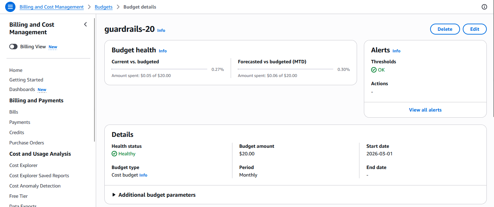
Fig. 1 - Creating a $20 monthly cost budget with alert thresholds.

**Configuration:**
- Budget type: Cost budget
- Scope: All AWS services
- Limit: $20/month
- Alerts: $10 and $20 thresholds (email notifications)

**Note:**
AWS budgets do not automatically stop resources. They only send alerts. Resources such as OpenSearch continue to incur charges until they are manually deleted.

### Creating the infrastructure
The original workshop foundation template used AWS Cloud9, but Cloud9 is no longer available to new customers, so I adapted the setup to use a local development environment while keeping OpenSearch provisioned through CloudFormation.

This step provisions the OpenSearch domain, which will serve as the indexed store for detected entities and timestamps later in the pipeline.

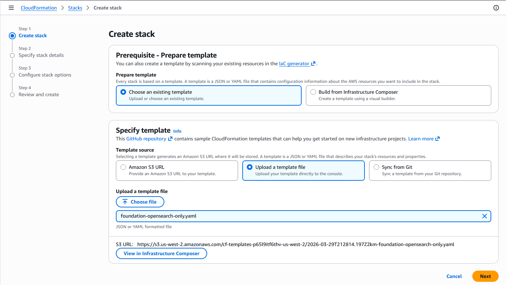

Fig. 2 - Creating a custom OpenSearch stack using /infra/reference/foundation-opensearch-only.yaml

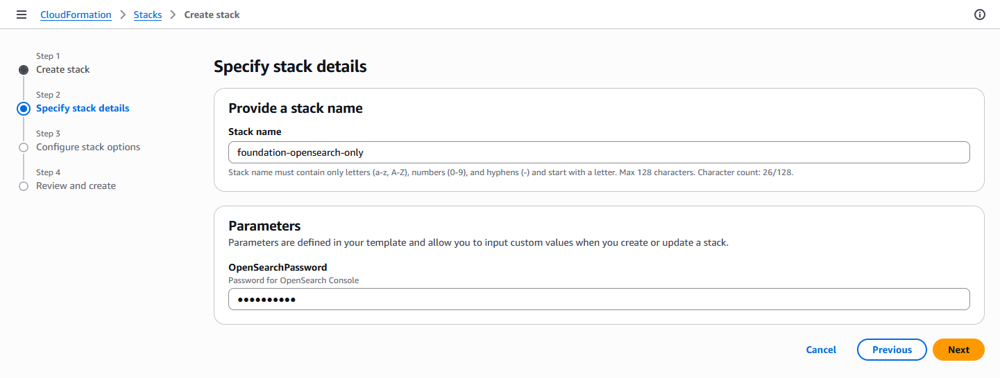

Fig. 3 - Go through the stack creation process until Submit and wait for create confirmation.

#### ⚠️ Note: OpenSearch provisioning typically takes 8–15 minutes. Billing begins once the domain status becomes ACTIVE.

**Observation:**
The OpenSearch access policy in the reference template is permissive for workshop simplicity. In a production scenario, access would be restricted to specific IAM roles or VPC endpoints.

### Foundation stack validation
The OpenSearch-only foundation stack completed successfully.

Validation steps:
- Confirmed CloudFormation stack reached `CREATE_COMPLETE`
- Retrieved the OpenSearch endpoint from stack outputs
- Logged into OpenSearch Dashboards using the configured admin account

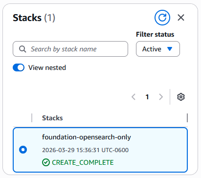

Fig. 4 - Stack Complete

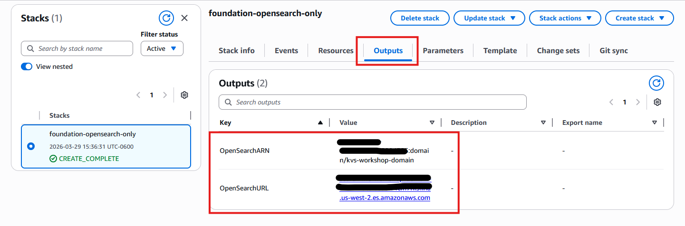

Fig. 5 - OpenSearch Output Tab

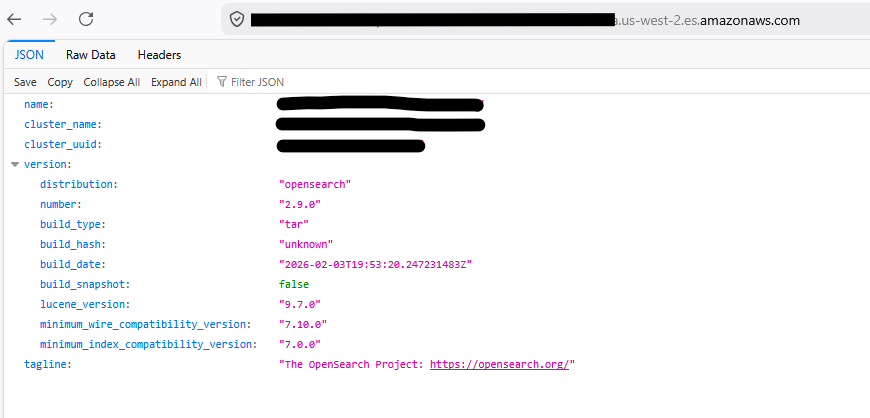

Fig. 6 - OpenSearch Root Endpoint

### Kinesis Video Streams setup

The next phase of the project establishes the video ingestion layer using Amazon Kinesis Video Streams (KVS) and WebRTC.

A signaling channel was created to support WebRTC communication between the local camera source and AWS-managed streaming services.

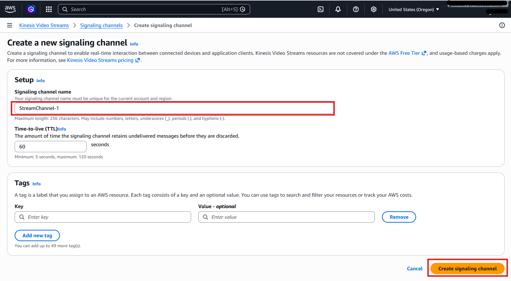

Fig. 7 - Creating the `StreamChannel` signaling channel for WebRTC communication.

A dedicated Kinesis Video Stream was also created for persistent video ingestion and later AI/ML analysis.

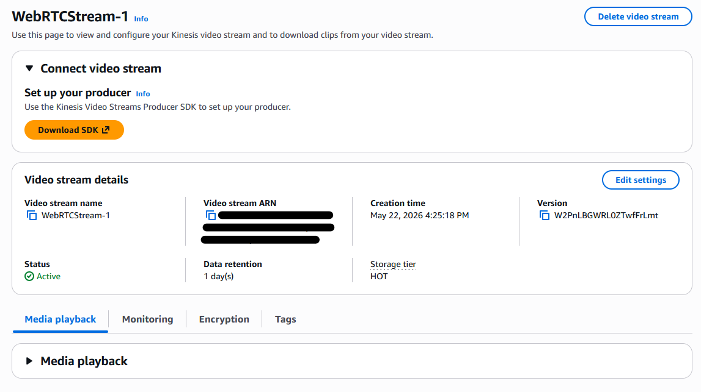

Fig. 8 - Creating the `WebRTCStream` Kinesis Video Stream for stored video ingestion.

### Application stack deployment

The application infrastructure stack was successfully deployed using a customized CloudFormation template derived from the AWS workshop architecture.

The stack provisions:
- AWS Lambda functions for Kinesis Video Stream processing, Rekognition indexing, and OpenSearch-backed search operations
- Amazon SNS for asynchronous Rekognition notifications
- Amazon API Gateway for search access
- AWS Step Functions for orchestration
- Amazon S3 for video clip storage
- Amazon CloudFront for media distribution

The deployment was parameterized to integrate with the previously provisioned OpenSearch domain and existing Kinesis Video Stream resources.

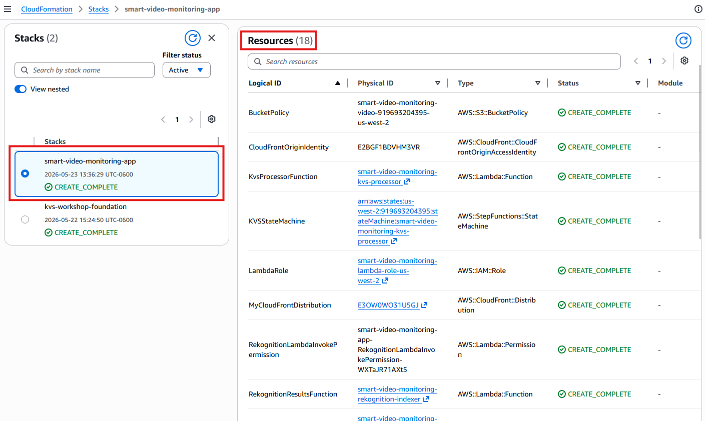

Fig. 9 - Application infrastructure stack successfully deployed with Lambda, SNS, API Gateway, CloudFront, Step Functions, and S3 integration resources.

### OpenSearch role mapping

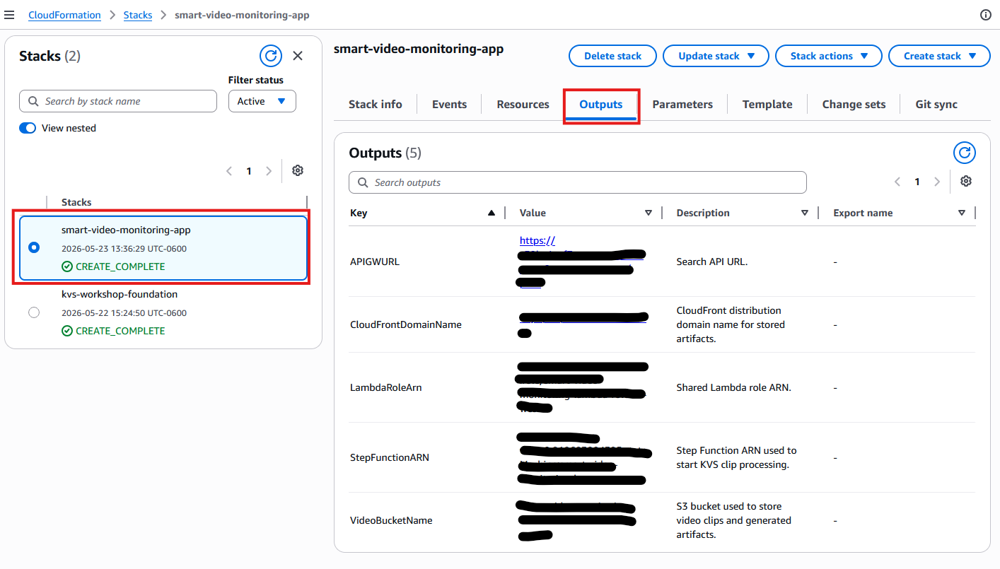

Fig. 10 - CloudFormation outputs generated by the application stack deployment, including API Gateway and CloudFront integration endpoints.

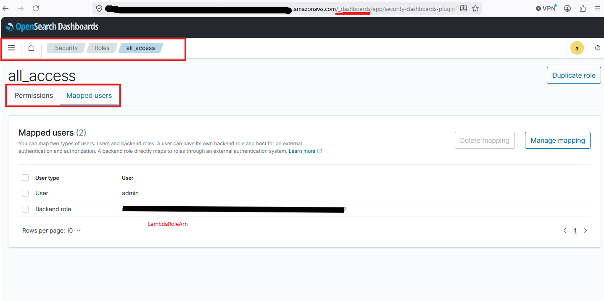

Fig. 11 - Mapping the Lambda execution role to the OpenSearch `all_access` role for indexing and search operations.

**Observation:**
The workshop architecture uses the `all_access` OpenSearch role for simplicity. A production implementation would instead use scoped permissions and least-privilege access controls.

### Test Video Injestion

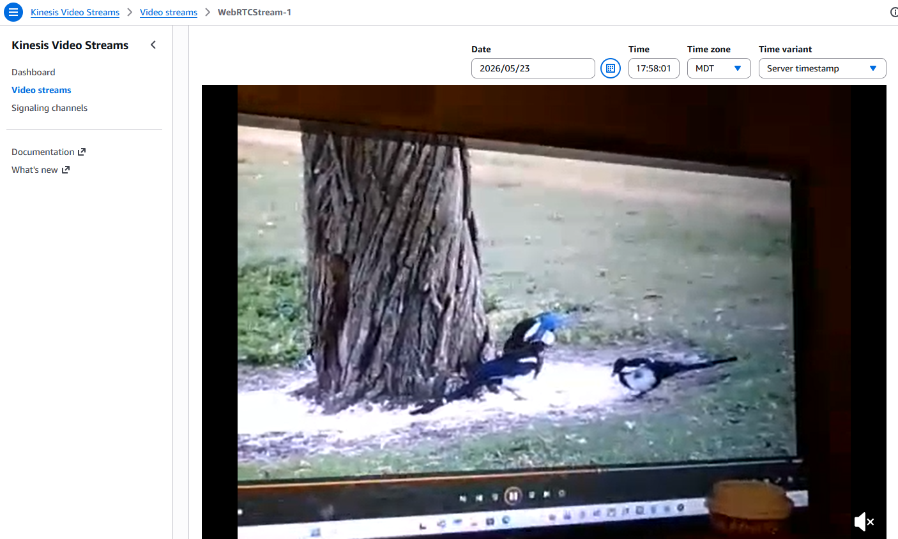

Fig. 12 - Stored playback from `WebRTCStream-1`, confirming WebRTC camera input was successfully ingested and persisted in Kinesis Video Streams.

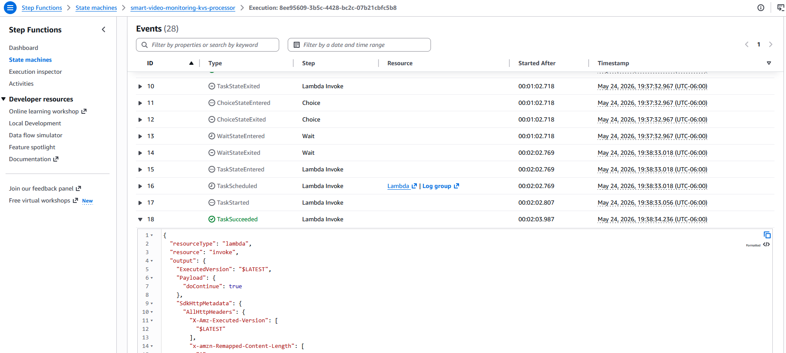

Fig. 13 - Successful Step Functions orchestration invoking the Kinesis Video Streams processing Lambda for clip extraction and downstream Rekognition analysis.

### Planned Enhancements
- Add time-range and confidence-based filtering to search API
- Implement cost-aware teardown and resource tagging strategy
- Review and tighten infrastructure security (IAM + OpenSearch access policies)

### Credits
Based on an AWS Workshops tutorial; implemented and extended independently. Inspired by Lucy Wang’s beginner AWS project list.
